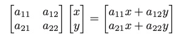

### 6 矩阵变换

6.1 2D线性变换

6.2 3D线性变换

6.3 平移和仿射变换

6.4 矩阵变换的逆变换

6.5 坐标变换

线性代数的机制可用于表达3D场景中排列对象，使用相机查看并显示在屏幕上所需的许多操作。可以通过矩阵乘法来完成例如旋转、平移、缩放和投影之类的几何变换，用于完成此操作的变换矩阵是本章的主题。

我们将展示一组点如何变换，如果这些点被表示为从原点开始的偏移向量，我们将使用图6.1中所示的时钟作为点集的示例。所以把时钟想象成一堆点，每个点由从原点出发的向量。我们还将讨论这些变换在 坐标（点）、位移向量和表面法线向量上操作的不同之处。

#### 6.1 2D线性变换
我们可以使用2 X 2的矩阵来改变或变换一个2D向量

这种通过一个简单矩阵乘以一个2维向量，得到一个新的2维向量的操作，就是一种线性变换。

通过上面这个简单的公式，在矩阵中输入不同的内容即可以实现各种有用的变换，下面将进行讨论。出于我们的目的，考虑沿x轴移动是水平移动，沿y轴移动是垂直移动。

#### 6.1.1 缩放
